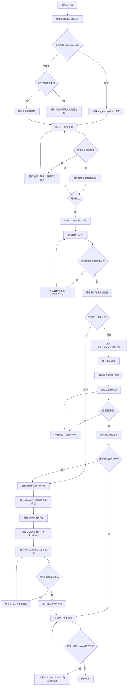

# 产品经理文档工作流 V1.2 更新日志

来源：微信公众号：松鼠的AI笔记。

V1.2 基于 V1.1 继续演进，核心目标是在需求文档定稿后增加 vibe coding / demo 生成路径：用户可以选择输出纯前端展示原型，也可以选择输出可以直接运行的可操作 demo；若先输出原型，原型定稿后还可以继续输出 demo。

## 继承自 V1.1 的能力

V1.2 保留了 V1.1 的主流程：

- 阶段一：需求拆解，先澄清目标、用户、功能、边界和非功能需求。
- 阶段二：生成需求文档，并通过 subagent review 检查完整性、清晰度、可行性和一致性。
- 阶段三：根据用户选择生成 HTML 页面原型或可运行 demo；原型定稿后可继续生成 demo。
- 阶段四：文档、原型或 demo 变更后，询问是否同步其他交付物。

V1.2 继续沿用 V1.1 的两个 HTML 模板：

```text
templates/
├── 需求说明文档模板.html
└── 原型备注模板.html
```

其中，`需求说明文档模板.html` 仍然支持双击正文进入编辑状态，保存时覆盖原文件即可更新文档。

## 整体工作流程图



## V1.2 主要更新

### 1. 增加原型 / demo 输出选择

需求文档定稿后，V1.2 不再默认进入原型生成，而是先询问用户选择交付物：

- 原型：纯前端展示页面，继续读取 `rules/prototype_workflow.md`。
- demo：可以直接运行的可操作实例，读取 `rules/demo_workflow.md`。

初始选择只能二选一。若用户选择原型，原型定稿后会再次询问是否继续生成 demo；若用户选择 demo，则不再反向生成原型。选择结果写入 `.pm_state.json` 的 `delivery_type` 字段，便于中断恢复和后续变更同步。

### 2. Demo 工作流独立化

V1.2 新增 `rules/demo_workflow.md`，将可运行 demo 的方案确认、任务拆解、生成、验证和定稿规则独立维护。

demo 流程参考 auto coding agent 的六步模式，但改造成适合产品需求文档的交付流程：

- 确认 demo 运行方式、技术栈和可操作流程。
- 用户无特殊要求时，由 AI 推荐最契合当前需求的技术栈，默认优先考虑 `Node.js` + `SQLite`；涉及 AI、模型调用或 Python 生态更合适时，可建议使用 `Python`。
- 用户有特殊技术要求时，AI 需要对比“AI 建议方案”和“用户指定方案”的优缺点，并在用户明确确认最终方案后再执行。
- 生成 demo 前检查是否存在同版本原型；若存在，经确认后结合需求文档和原型生成，需求文档负责功能规则，原型负责 UI、布局和交互参考；若不存在，则仅按需求文档生成 demo。
- 创建版本隔离的 demo 目录。
- 用 `task.json` 拆解可并行任务。
- 多个独立 Sub-Agent 同时生成 demo，不在单任务完成后中断等待用户确认。
- 所有任务完成后统一更新 `progress.txt` 并进入验证。
- 运行 lint/build/test 或必要的浏览器验证。
- 验证通过后等待用户确认定稿。

### 3. 统一变更同步流程

V1.2 新增 `rules/sync_workflow.md`，集中处理文档、原型和 demo 的一致性维护。

任一交付物变更后，先展示变更来源、影响范围和建议同步目标，再由用户确认同步范围：

- `delivery_type=prototype`：维护文档与原型一致性。
- `delivery_type=demo`：维护文档与 demo 一致性。
- `delivery_type=prototype_then_demo`：维护文档、原型、demo 三方一致性。

同步时按需读取 `requirements_workflow.md`、`prototype_workflow.md` 或 `demo_workflow.md`，同步完成后重新运行对应 review 或验证。

### 4. Demo 版本目录隔离

demo 实例统一创建在根目录 `demo/` 下，并按需求文档版本号命名子文件夹：

```text
demo/
└── v1.0/
    ├── README.md
    ├── task.json
    ├── progress.txt
    └── ...
```

不同版本 demo 不得共用 mock 数据、运行数据、缓存文件或上传文件，避免版本间互相污染。

### 5. 规则与流程文件集中管理

V1.2 延续 V1.1 的目录原则：阶段规则、review 提示词、Sub-Agent 分发规范、任务状态文件和 demo 工作流统一放到根目录 `rules/` 下：

```text
rules/
├── requirements_workflow.md
├── prototype_workflow.md
├── demo_workflow.md
├── sync_workflow.md
├── review_doc.md
├── review_prototype.md
├── subagent_dispatch.md
└── task-state.md
```

`CLAUDE.md` 只保留启动序列、状态结构、阶段路由和恢复规则。具体规则与流程文件在需要时再读取，减少主上下文负担，也方便集中查阅和维护。

### 6. Review 提示词独立化

V1.2 延续文档 review 和原型 review 提示词独立维护的方式：

```text
rules/
├── review_doc.md
└── review_prototype.md
```

这样可以单独维护 review 标准，也方便后续增强审查维度。

### 7. 模板目录保持纯净

`templates/` 目录只保留可复用的模板文件：

```text
templates/
├── 需求说明文档模板.html
└── 原型备注模板.html
```

规则、流程、review、状态类文件不再放入 `templates/`，避免模板资产与运行约束混在一起。

### 8. Sub-Agent 分发规范

V1.2 继续使用 `rules/subagent_dispatch.md`，规定每个原型页面任务和 demo 实现任务都必须包含任务标题、执行范围、验收标准和上下文四要素。

这让页面原型和 demo 实现都更适合分发给多个 subagent，并降低不同任务互相误改的风险。

### 9. 并行原型生成

V1.2 保留并行生成 HTML 原型能力。只有在页面内容独立、不写同一文件、范围清晰时才允许并行。

并行生成后会记录：

- `prototype_pages.confirmed_list`：已确认页面列表。
- `prototype_pages.completed`：已完成页面。
- `prototype_pages.failed`：生成失败页面。
- `rules/task-state.md`：subagent 页面任务状态。

失败任务最多重试 3 次，超过后上报用户决策。

### 10. MEMORY.md 跨会话记忆

V1.2 继续使用 `MEMORY.md`，用于记录 `.pm_state.json` 不适合保存的项目内容记忆。

`.pm_state.json` 记录执行状态：

- 当前阶段。
- 文档路径。
- 原型路径。
- demo 路径、版本、技术栈和运行命令。
- checkpoint。
- review 结果。

`MEMORY.md` 记录项目记忆：

- 项目背景。
- 已确认决策。
- 已否决方案。
- 待确认问题。
- 用户偏好。
- 关键行为规则快照。

启动时会静默读取 `MEMORY.md`。文件不存在时跳过，不向用户报错。

### 11. Compaction Instructions 压缩保护

V1.2 继续保留 `Compaction Instructions`，用于保护长会话压缩后的恢复能力。

当对话被压缩时，摘要末尾必须保留恢复指令，要求继续任务前按顺序重读：

```text
CLAUDE.md
MEMORY.md
.pm_state.json
```

这相当于在 compact 后执行一次轻量恢复：从 `CLAUDE.md` 恢复规则，从 `MEMORY.md` 恢复项目记忆，从 `.pm_state.json` 恢复执行现场。

## V1.2 文件结构

```text
V1.2/
├── CLAUDE.md
├── MEMORY.md
├── README.md
├── rules/
│   ├── requirements_workflow.md
│   ├── prototype_workflow.md
│   ├── demo_workflow.md
│   ├── sync_workflow.md
│   ├── review_doc.md
│   ├── review_prototype.md
│   ├── subagent_dispatch.md
│   └── task-state.md
├── templates/
│   ├── 需求说明文档模板.html
│   └── 原型备注模板.html
└── demo/
    └── v1.0/
```

## 升级价值

相比 V1.1，V1.2 的重点是把“需求文档 → 可运行 demo”的路径纳入同一套可恢复工作流：

- 文档定稿后先明确选择原型或 demo，原型定稿后可继续输出 demo，交付路径更清楚。
- demo 工作流独立维护，避免主文件膨胀。
- demo 支持多个 Sub-Agent 并行生成，减少长流程等待。
- sync 工作流统一维护三方一致性，减少规则分散造成的歧义。
- demo 按版本目录隔离，历史版本可运行数据不被覆盖。
- `task.json` 与 `progress.txt` 让 demo 实现过程可追踪、可恢复。
- 验证规则要求 demo 真正可运行，而不是只生成代码文件。
