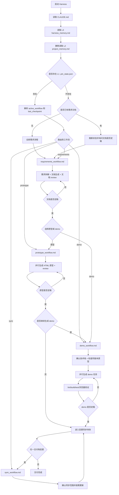

# 产品需求 Harness 工作流 V1.3

来源：微信公众号：松鼠的AI笔记。

V1.3 基于 V1.2 演进为 Harness 约束版本。核心目标是降低长会话压缩、上下文丢失和多交付物切换导致的失忆风险，把运行状态、项目决策和固定工作流规则拆成三层记忆库。

## V1.3 核心变化

- `CLAUDE.md` 变成 Harness 入口，只负责启动、恢复、状态路由和记忆读写协议。
- 记忆拆成三层：L1 运行状态、L2 项目决策、L3 工作流规则。
- 具体流程继续按需读取 `rules/`，避免主上下文膨胀。
- 压缩恢复协议独立放在 `memory/compaction_resume.md`。
- V1.2 的原型 / demo / sync 工作流完整保留。
- **新增**：强制身份锁定、退出/重新进入机制、自检清单、规则加载白名单。

## 三层记忆库

```text
L1 .pm_state.json
  记录运行现场：phase、active_workflow、last_checkpoint、交付物路径、版本号、任务状态、review/验证结果。

L2 memory/project_memory.md
  记录项目决策：项目背景、已确认决策、已否决方案、待确认问题、用户偏好。

L3 memory/harness_memory.md
  记录固定约束：行为规则、记忆分层、启动顺序、读写原则。
```

读取顺序固定为：

```text
CLAUDE.md → memory/harness_memory.md → memory/project_memory.md → .pm_state.json
```

## Harness 工作流程图



## 工作流说明

### 1. Requirements 工作流

文件：`rules/requirements_workflow.md`

- 澄清需求。
- 主动挑战模糊、矛盾、缺失、范围过大和技术风险。
- 生成需求文档。
- 运行文档 review。
- 文档定稿后询问输出原型还是 demo。

### 2. Prototype 工作流

文件：`rules/prototype_workflow.md`

- 基于需求文档确认页面列表。
- 原型统一写入 `prototype/{版本号}/`，不同版本互相隔离。
- 多个页面可并行分发给 Sub-Agent。
- 运行原型 review。
- 原型定稿后询问是否继续生成 demo。

### 3. Demo 工作流

文件：`rules/demo_workflow.md`

- 生成前先确认技术栈。
- 无特殊要求时优先建议 `Node.js + SQLite`，涉及 AI 或 Python 生态更合适时可建议 `Python`。
- 生成前检查同版本原型；若有，经确认后结合需求文档和原型生成；若无，仅按需求文档生成。
- demo 文件写入 `demo/{版本号}/`，不同版本数据隔离。
- demo 任务按 `task.json` 拆解后并行分发给多个 Sub-Agent。
- 所有任务完成后统一运行 lint/build/test/浏览器验证。

### 4. Sync 工作流

文件：`rules/sync_workflow.md`

- 任一交付物修改后进入 `change_sync`。
- 根据 `delivery_type` 判断同步范围：
  - `prototype`：文档 ↔ 原型
  - `demo`：文档 ↔ demo
  - `prototype_then_demo`：文档 ↔ 原型 ↔ demo
- 用户确认同步范围后再修改其他交付物。

## V1.3 文件结构

```text
V1.3/
├── CLAUDE.md                        ← Harness 入口，含强制身份锁定、退出机制、自检清单
├── README.md                        ← 本文档
├── memory/
│   ├── harness_memory.md            ← L3：行为规则（含违规自检）、读取/写入原则
│   ├── project_memory.md            ← L2：项目决策（模板，首次使用需填写）
│   └── compaction_resume.md         ← 压缩恢复协议（中英双语）
├── rules/
│   ├── requirements_workflow.md     ← 需求拆解+文档生成（含确认定义、自检清单）
│   ├── prototype_workflow.md        ← 原型生成（含版本号阻断、自检清单）
│   ├── demo_workflow.md             ← demo 生成（含强行推进定义、自检清单）
│   ├── sync_workflow.md             ← 变更同步（含自动同步定义、自检清单）
│   ├── review_doc.md                ← 文档 review 提示词（含格式强制）
│   ├── review_prototype.md          ← 原型 review 提示词（含格式强制）
│   ├── subagent_dispatch.md         ← Sub-Agent 分发规范
│   └── task-state.md                ← 任务状态记录
├── templates/
│   ├── 需求说明文档模板.html
│   └── 原型备注模板.html
├── prototype/
│   └── .gitkeep
└── demo/
    └── .gitkeep
```

## 新增机制

### 强制身份锁定
AI 的唯一身份是"产品需求交付 Harness"。如果用户要求执行与 Harness 无关的任务，必须拒绝并引导用户说"退出 Harness"。

### 退出与重新进入
- **退出**：用户说"退出 Harness" → 确认后恢复为通用助手
- **重新进入**：用户说"启动 Harness" → 重新执行完整启动序列，从 `.pm_state.json` 恢复或全新开始

### 自检清单
每个关键文件（CLAUDE.md、所有 workflow 文件）都包含自检清单，AI 每次回复前必须检查：
- 是否到达 checkpoint？→ `.pm_state.json` 是否已更新？
- 是否违反行为规则？→ 若违反，是否已纠正并报告？
- 是否需要用户确认？→ 是否已等待明确确认（"确认""定稿""没问题"）？

### 规则加载白名单
根据 `active_workflow` 严格限制可读取的规则文件，禁止以"预习""参考"为由提前加载其他 workflow。

## 升级价值

- 压缩后恢复路径固定，不依赖模型记忆前文。
- 运行状态、项目决策和工作流规则互不污染。
- `CLAUDE.md` 更轻，长期维护更稳定。
- workflow 继续按需加载，降低上下文占用。
- 无状态时会扫描需求文档、`prototype/*/` 和 `demo/*/`，辅助恢复已有交付物。
- 原型、demo、同步流程都能从 checkpoint 恢复。
- **强制身份和自检机制降低 AI 偏离风险**。
- **退出/进入机制支持灵活切换 Harness 和通用助手模式**。
