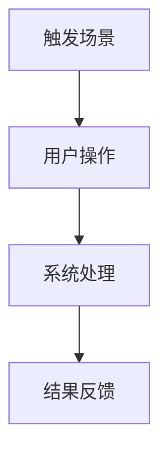

# 目的背景介绍

## 为什么做

- 业务背景：
- 当前问题：
- 用户痛点：
- 机会或收益：
- 不做的影响：

## 相关方与约束

| 类型 | 内容 | 影响 |
|---|---|---|
| 业务方 |  |  |
| 技术方 |  |  |
| 合规/安全 |  |  |
| 时间/资源 |  |  |

# 产品目标与衡量指标

| 目标 | 指标口径 | 当前基线 | 目标值 | 统计周期 | 数据来源 | 负责人 |
|---|---|---:|---:|---|---|---|
|  |  | 待确认 | 待确认 |  |  |  |

> 没有可量化指标时，必须写明待确认项、确认人和确认时间；不得只写“提升效率”“优化体验”。

# 用户角色与场景

| 角色 | 权限/能力 | 核心任务 | 触发场景 | 前置条件 | 成功结果 |
|---|---|---|---|---|---|
|  |  |  |  |  |  |

# 业务流程图与产品架构图

## 业务流程

## 产品架构

| 模块 | 职责 | 输入 | 输出 | 依赖 |
|---|---|---|---|---|
|  |  |  |  |  |

# 功能边界

## 本期做什么

-

## 本期不做什么

-

## 后续版本考虑

-

# 功能需求明细

## 模块一：{模块名称}

### 功能说明

- 目标：
- 入口：
- 使用角色：
- 前置条件：
- 后置结果：

### 页面可见内容

| 元素 | 类型 | 默认值 | 状态 | 校验 | 提示文案 | 备注 |
|---|---|---|---|---|---|---|
|  |  |  |  |  |  |  |

### 交互与跳转

| 触发动作 | 系统响应 | 成功跳转/反馈 | 失败提示 | 埋点 |
|---|---|---|---|---|
|  |  |  |  |  |

### 权限与状态

| 状态/角色 | 可见 | 可操作 | 禁止操作 | 规则说明 |
|---|---|---|---|---|
|  |  |  |  |  |

# 业务规则与数据规则

## 计算规则

| 规则编号 | 规则描述 | 公式/判断 | 示例 | 异常处理 |
|---|---|---|---|---|
| R-001 |  |  |  |  |

## 状态机

| 当前状态 | 触发条件 | 下一状态 | 可操作角色 | 系统动作 | 通知/日志 |
|---|---|---|---|---|---|
|  |  |  |  |  |  |

## 外部对接

| 系统/接口 | 方向 | 数据项 | 触发时机 | 成功处理 | 失败处理 |
|---|---|---|---|---|---|
|  |  |  |  |  |  |

## 数据生命周期

| 数据对象 | 创建 | 使用 | 更新 | 删除/归档 | 保存周期 | 脱敏要求 |
|---|---|---|---|---|---|---|
|  |  |  |  |  |  |  |

# 非功能需求与上线计划

## 非功能需求

| 类别 | 要求 | 验收标准 |
|---|---|---|
| 性能 |  |  |
| 安全 |  |  |
| 兼容性 |  |  |
| 可用性 |  |  |
| 可观测性 |  |  |

## 上线计划

| 项目 | 方案 | 负责人 | 验收/回滚条件 |
|---|---|---|---|
| 数据迁移 |  |  |  |
| 灰度策略 |  |  |  |
| 回滚方案 |  |  |  |
| 通知与培训 |  |  |  |

# 依赖与风险

| 风险/依赖 | 类型 | 影响 | 概率 | 应对方案 | 负责人 | 状态 |
|---|---|---|---|---|---|---|
|  |  |  |  |  |  |  |

# 测试与验收自检清单

| 检查项 | 必须覆盖的问题 | 结论 | 备注 |
|---|---|---|---|
| 输入校验 | 格式、长度、必填、默认值、提示文案 | 待确认 |  |
| 异常情况 | 超时、断网、空数据、并发冲突、接口失败 | 待确认 |  |
| 边界值 | 0、上限、分页极端、字段截断、重复提交 | 待确认 |  |
| 历史数据 | 迁移策略、旧版兼容、老数据展示与回滚 | 待确认 |  |
| 数据安全 | 脱敏、权限、日志、存储周期、导出控制 | 待确认 |  |
| 指标与埋点 | 指标是否可量化，埋点是否覆盖关键路径 | 待确认 |  |

# 附录

## 原型与批注边界

- 原型批注：只承载页面可见内容，例如 UI、字段校验、跳转、交互状态和提示文案。
- PRD 文档：承载背景、业务逻辑、计算规则、状态机、外部对接、权限、数据生命周期、上线计划和风险。

## 待确认问题

| 编号 | 问题 | 影响 | 确认人 | 期限 | 状态 |
|---|---|---|---|---|---|
| Q-001 |  |  |  |  | 待确认 |
